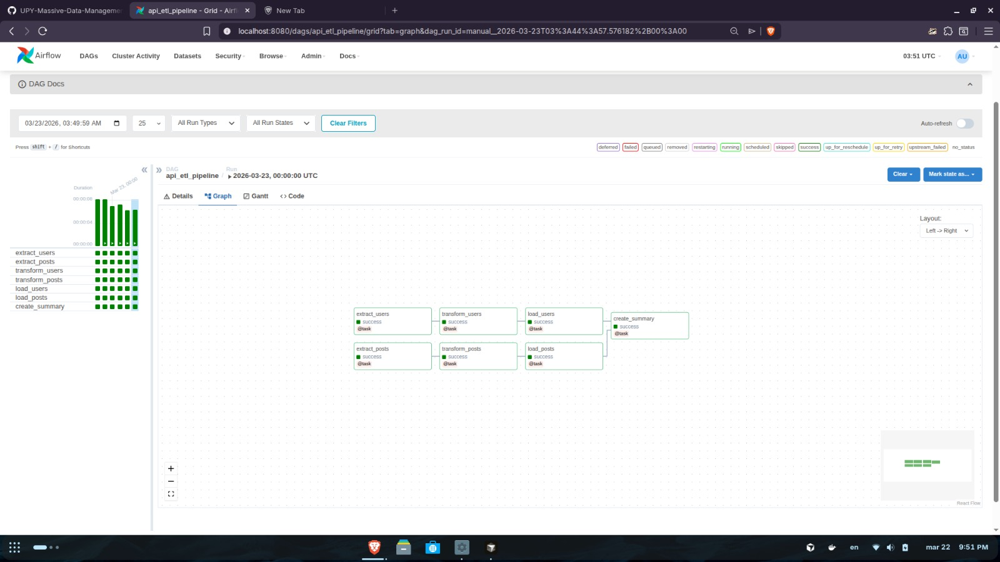
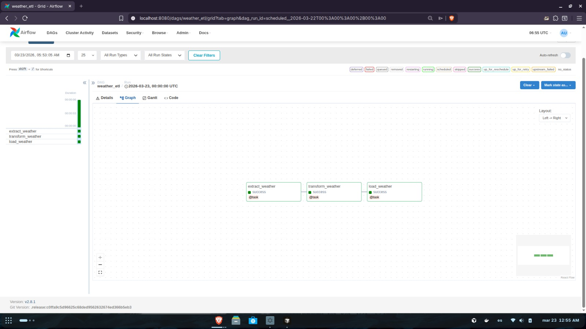

# Weather ETL Pipeline (Airflow Orchestration)

This project demonstrates a production-grade ETL workflow orchestrated by **Apache Airflow**. It extracts 24-hour environmental data from the Open-Meteo API, applies schema mapping and data transformations using Pandas, and handles dual-format storage (CSV/JSON).

## 🚀 How to Run with Docker

This repository includes a standard Airflow `docker-compose.yaml`. To get started:

1. **Initialize the environment:**
   ```bash
   mkdir -p ./logs ./plugins ./config
   echo -e "AIRFLOW_UID=$(id -u)" > .env
   docker compose up airflow-init
   ```

2. **Start Airflow:**
   ```bash
   docker compose up -d
   ```

3. **Access the UI:**
   Go to [http://localhost:8080](http://localhost:8080)
   - **User:** `airflow`
   - **Password:** `airflow`

4. **Trigger the DAG:**
   Locate `weather_etl` in the DAGs list and toggle it to **On**.

## 📊 Visual Proof

### DAG Graph View


### Successful Run


## ETL Logic Overview

The extraction phase consists of a single task:
- `extract_weather()`: Fetches a 24-hour hourly forecast from the Open-Meteo API for specific coordinates (latitude 52.52, longitude 13.419998). It requests specific metrics: `temperature_2m` and `apparent_temperature`. The task handles HTTP requests and returns the raw JSON dictionary payload.

## Transform phase

The transformation phase processes the raw payload:
- `transform_weather()`: Extracts top-level metadata (latitude, longitude, timezone, elevation) and iterates through the 24-hour arrays. It stamps this metadata onto every individual hourly record to flatten the structure. It also derives new fields, including Fahrenheit conversions (`temperature_2m_Fahrenheit`, `feels_like_fahrenheit`) and a categorical classification (`temp_category` such as "Extremely Cold"). It returns a standardized list of dictionaries.

## Load phase

The load phase secures the processed data:
- `load_weather()`: Receives the transformed list of dictionaries, converts it into a Pandas DataFrame, and writes it to the `/opt/airflow/data/` directory in two formats simultaneously:
  - **CSV**: Saved for easy tabular readability.
  - **JSON**: Saved with `orient="records"` for system-to-system readability.
Both files are named dynamically with a timestamp (e.g., `weather_YYYYMMDD.csv` and `weather_YYYYMMDD.json`). The task returns a dictionary containing the absolute file paths of the generated files.

## Data Flow

The data flow is strictly sequential and relies entirely on implicit XComs managed by the TaskFlow API. The outputs of the decorated `@task` functions are automatically serialized and passed as arguments to the downstream functions.

```mermaid
flowchart LR
    E[extract_weather<br/>Fetch API data]
    T[transform_weather<br/>Clean + derive fields]
    L[load_weather<br/>Save CSV + JSON]

    E --> T --> L